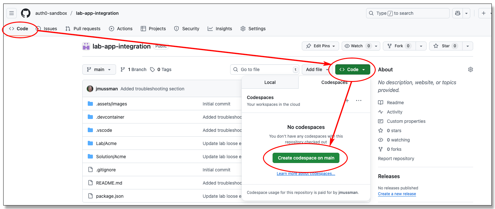
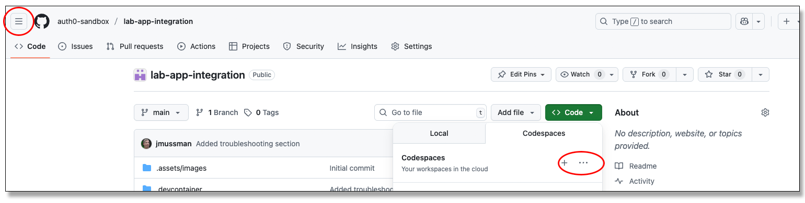

# Verify GitHub Codespace Access

## Synopsis

This repository only exists to verify access to GitHub Codespaces: that they may be created and connected to.
Accessing a codespace from an enterprise computer or network may be blocked in order to prevent leakage.
Starting and connecting to a codespace using this repository will prove (or disprove) that using a codespace is possible.

## Testing the GitHub Codespace

Start on the **\<> Code** tab of this repository (or any that offers a codespace),
look for the green **\<> Code** button and click it.
Make sure the **Codespaces** tab is selected, and click the green button **Create codespace on main**.
This will launch Visual Studio Code in a new tab in your browser, and connect it to a Docker container (a virtual computer)
running Linux in the cloud:

The repository files are present on the Linux computer, along with any other tools the designer may have included.
Visual Studio Code is the interface to the files and actions on the Docker container.
VS Code connects to the container, and the files edited are in the container but the VS Code
application is actually running in the local browser. 
All file changes are persisted until the Codespace is deleted.

Codespaces will time out and shut down if you are not using them.
If you are still on the page that was connected to the codespace in the browser use the button to restart it.
The codespace may also be restarted or deleted from the ellipsis button off of the *\<> Code* button at the repository,
or from the *Codespaces* menu item off of the *hamburger* menu button next to the *GitHub Cat* icon in the GitHub account:

