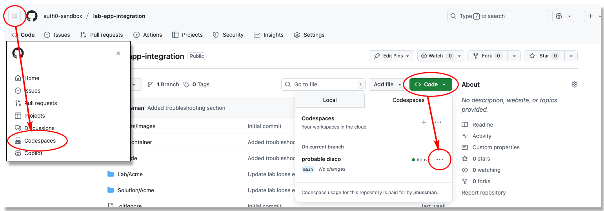

# Verify GitHub Codespace Access

## Synopsis

This repository only exists to verify access to GitHub Codespaces: that they may be created and connected to.
It serves no other purpose and has no other files installed.
Accessing a codespace from an enterprise computer or network may be blocked in order to prevent leakage.
Starting and connecting to a codespace using this repository will prove (or disprove) that using a codespace is possible
from the local computer.

## Testing the GitHub Codespace

Start on the **\<> Code** tab of this repository (or any that offers a codespace),
look for the green **\<> Code** button and click it.
Make sure the **Codespaces** tab is selected, and click the green button **Create codespace on main**.
This will launch Visual Studio Code in a new tab in your browser, and connect it to a Docker container (a virtual computer)
running Linux in the cloud:

The repository files are cloned on the Linux computer, along with any other tools the designer may have included.
Visual Studio Code is the interface to the files and actions in the Docker container.
VS Code is actually running on the local computer as an application in the browser.
VS Code connects to the container, the files are edited in the container, and applications launched
from the *Run/Debug* panel are launched inside the container.

## Timeout

Codespaces will time out and be stopped if you are not using them.
If you are still on the browser page where VS Code was connected to the codespace there will be a button to restart it.
When a codespace restarts the changes to the files will be intact, but running applications will not be restarted:

## Management

Codespaces may also be restarted or deleted from two places: the **\<> Code** button has a list of the code spaces
started from the current repository and an ellipsis button to manage each.
Clicking the *hamburger button* next to
the *GitHub Cat* icon reveals a menu with an option to manage all the codespaces in the account:

## Limits

When a lab is finished the codespace should be deleted.
GitHub has limits on the number of free codespaces that may be simultaneously created in an account, the amount of
storage used by these codespaces, how many may be active at the same time, and the total number of "core hours"
codespaces may use monthly in an account.